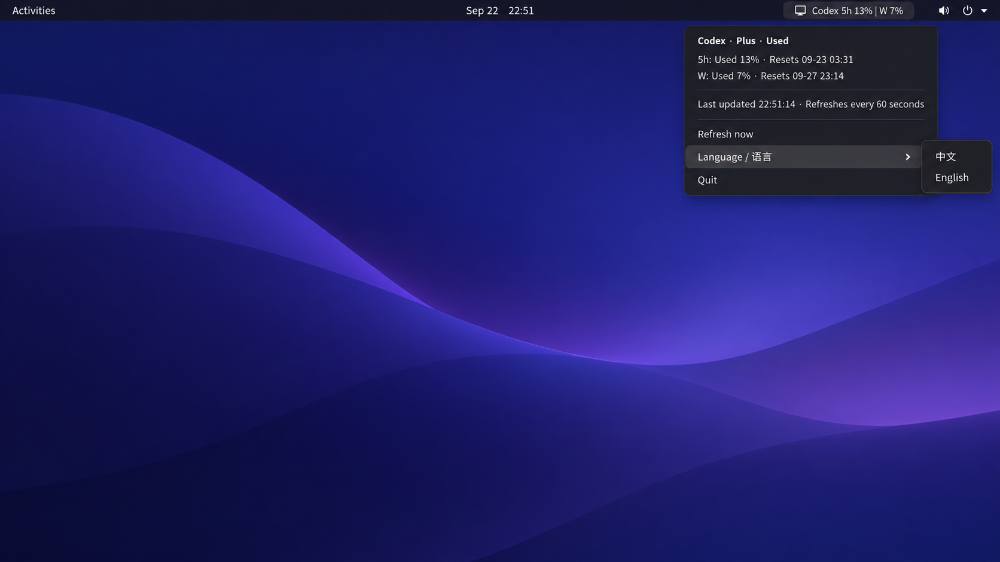

# Codex Usage Topbar

[English README](README.md)

在 Ubuntu GNOME 顶栏显示当前 Codex 订阅额度。它使用本机已经登录的 Codex 账户，不会读取或保存登录令牌。



顶栏会显示类似 `Codex 5h 13% | 周 7%` 的文字；百分比表示已用额度。点击指示器可查看本地重置时间，并随时手动刷新。

通过菜单中的 **语言 / Language** 可切换中文和 English。选择会保存到 `~/.config/codex-usage-topbar/config.json`，下次启动时自动恢复。

## 运行环境

- 已启用 Ubuntu AppIndicators 扩展的 Ubuntu GNOME
- Python 3、PyGObject / GTK 3、libayatana-appindicator3
- 已登录的 Codex CLI 或 Codex desktop app

## 安装

```bash
git clone <你的仓库地址>
cd codex-usage-topbar
bash install.sh
```

程序会安装到 `~/.local/share/codex-usage-topbar`。安装脚本会创建 `~/.config/autostart/codex-usage-topbar.desktop`，因此下次登录会自动启动；不需要 sudo。

## 卸载

先在顶栏菜单选择 **退出 / Quit**，然后执行：

```bash
rm ~/.config/autostart/codex-usage-topbar.desktop
rm -r ~/.local/share/codex-usage-topbar
```

## 数据来源

组件每 60 秒通过 Codex app-server 的 `account/rateLimits/read` 接口读取订阅额度。详情请见 [Codex App Server documentation](https://learn.chatgpt.com/docs/app-server)。
